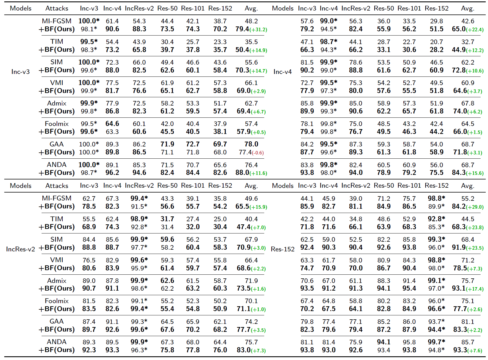
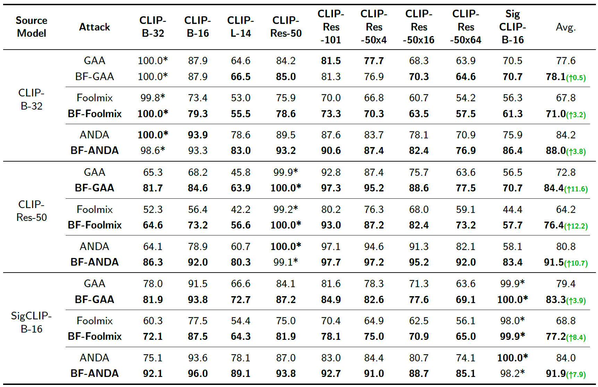

# BF-Attack (Boundary Fitting Attack)

This is the official implementation of **BF-Attack**, an adversarial attack enhancement module designed to improve the transferability of adversarial examples across diverse architectures.

This repository is built upon the [TransferAttack](https://github.com/Trustworthy-AI-Group/TransferAttack) framework.

## 📖 Introduction
BF-Attack (Boundary Fitting Attack) focuses on leveraging decision boundary information to refine the gradient direction during the generation of adversarial examples. By sampling and fitting the boundary geometry, it generates more robust perturbations that translate better from source models to various black-box target models.

## 🛠️ Environment Configuration

To set up the environment, please follow these steps:

```bash
# Create a new conda environment
conda create -n BF python=3.9 -y
conda activate BF

# Install CLIP dependency
pip install git+[https://github.com/openai/CLIP.git](https://github.com/openai/CLIP.git)

# Install other required dependencies
pip install -r requirements.txt

```
## 🚀 Usage

1. Generating Adversarial Perturbations
To craft adversarial examples using the BF-Attack module, run the following script:

```bash
bash attack.sh
```

2. Evaluating Attack Success Rate (ASR)
To verify the performance of the generated samples against various target models, run:

```bash
bash validation.sh
```

## 📊 Experimental Results

The following table summarizes the attack success rates (%) of black-box attacks against six normally trained models. The adversarial examples are crafted using an ensemble of Inc-v3, Inc-v4, IncRes-v2, and Res-152.


The following table summarizes the attack success rates (%) of black-box attacks against nine multimodal models (CLIPs). The adversarial examples are crafted via CLIP-ViT-B-16, CLIP-RES50 and SigCLIP.

## 📜 Citation

The manuscript is currently under review at Information Fusion. The citation and link will be updated once available.

## ⚖️ License
This project is licensed under the MIT License - see the LICENSE file for details. This repository incorporates code from the TransferAttack project.
